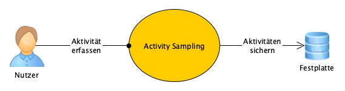
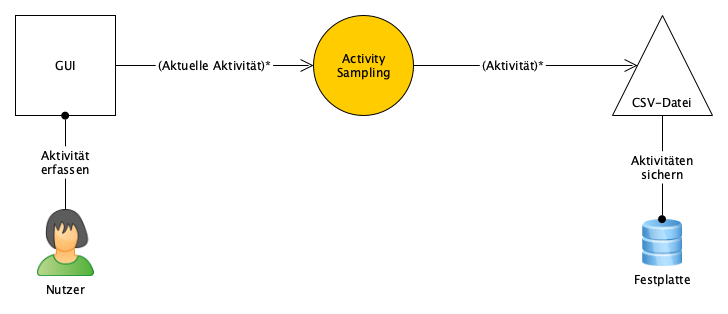

= Architekturüberblick

== Mission Statement

// 2-6 Anstriche oder Sätze

* Als Softwareentwickler oder Selbstständiger möchte ich meine Aktivitäten
  erfassen.
* Ich möchte beurteilen wofür ich meine Zeit verwende.
* Ich kann nachweisen, wieviel Zeit ich für eine Aufgabe benötige.
* Ich muss nicht meine Tätigkeiten aufgezeichnten Zeiten zuordnen, sondern ich
  werde regelmäßig gefragt, welcher Tätigkeit ich gerade nachgehe.
* Mit den erfassten Informationen kann ich ähnliche Aufgaben in Zukunft besser
  schätzen und ich kann entscheiden, wofür ich mehr oder weniger meiner Zeit
  investiere.

== Kontextabgrenzung

.Kontextabgrenzung

Der Nutzer erfasst mit Activity Sampling seine Aktivitäten. Diese werden auf der
Festplatte gesichert.

== Architekturziele

// Top 3-5, Tabelle enthält Begriffe aus ISO 25010 als Beispiele

.Architekturziele
[cols="2,5a"]
|===
| Architekturziel | Motivation

|Funktionale Eignung: Angemessenheit
|Für ein einfaches Problem, wird eine einfache Lösung gesucht. Ein Stundenzettel
oder die Pomodoro-Technik sind ähnliche, einfache Ansätze.

|Benutzbarkeit: Bedienbarkeit
|Der Nutzer muss häufig und zwischen seiner eigentlichen Arbeit mit der App
interagieren. Das Erfassen der aktuellen Aktivität muss daher kurz und einfach
möglich sein.

|Sicherheit: Vertraulichkeit
|Die erfassen Aktivitäten sollten kein Sicherheitsproblem sein, dennoch müssen
sie vor unbefugten Zugriff geschützt werden.

|Kompatibilität: Interoperabilität
|Die Erfassung der Aktivitäten muss von verschiedenen Geräten aus möglich sein
und die erfassten Daten leicht weiterverarbeitbar (z.B. Auswertung mit Excel).
|===

== Lösungsstrategie

.Lösungsstrategie
[cols="2,5a"]
|===
| Architekturziel | Lösungsansatz

|Funktionale Eignung: Angemessenheit
|
* Die grafische Oberfläche wird aus fertigen Komponenten aus dem Ionic-Framewerk
  zusammengebaut. So wenig Eigenentwicklung wie möglich, möglichst nur
  zusammenstecken.
* Die erfassten Aktivitäten werden als CSV-Datei gesichert, ein Datensatz
  (Zeile) entspricht einer Aktivität zum Erfassungszeitpunkt.

|Benutzbarkeit: Bedienbarkeit
|
* Schmale Benutzerschnittstelle, wenige Interaktionen.

|Sicherheit: Vertraulichkeit
|
* Daten werden auf lokaler Festplatte zum Beispiel im Nutzerverzeichnis
  gesichert.

|Kompatibilität: Interoperabilität
|
* Aktivitäten werden als CSV-Datei kompatibel mit Excel gesichert.
|===

== Informelles Überblicksbild

.Informelles Überblicksbild

