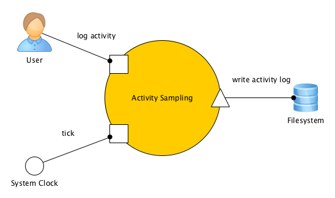

# Use Cases für Activity Sampling

Die Systemuhr triggert die Applikation in einem einstellbaren Intervall, zum
Beispiel 20 Minuten. Wenn das Intervall abgelaufen ist, wird der Nutzer nach
seiner aktuellen Tätigkeit gefragt. Diese wird im Dateisystem in einer CSV-Datei
als Datensatz mit Zeitstempel der Nachfrage, dazugehörigen Zeitraum (entspricht
Intervall) und der Bezeichnung der Tätigkeit gesichert.

__Entwurf:__

*   [Domain Design](domain-design.md)
*   [Flow Design](flow-design.md)
