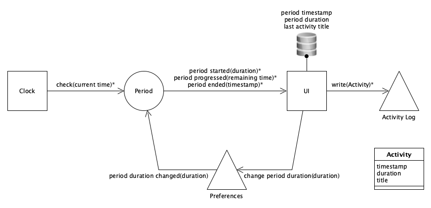

# Application Activity Sampling

## Domain Design

### Dialog Activity Log

#### System clock ticks

*   Update elapsed time.
*   Update remaining time.
*   Check period ended.
*   If period ended, ask for current activity.

#### User logs activity

*   Show activity with timestamp in dialog.
*   Group activities by day in dialog.
*   Write activity with timestamp and duration to disk.

## Flow Design

